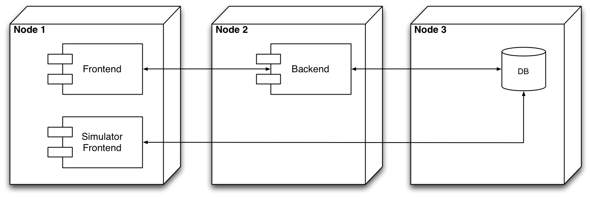
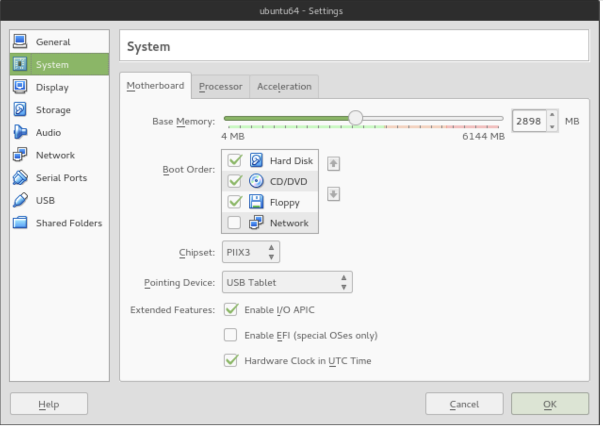
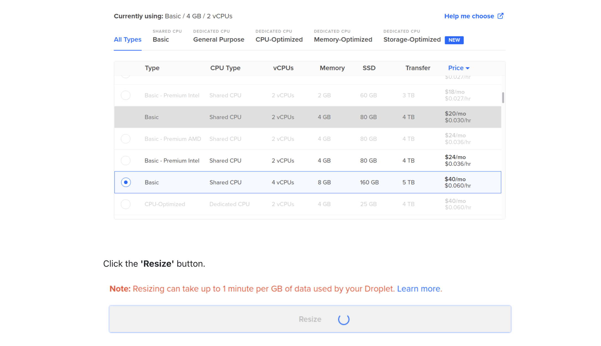
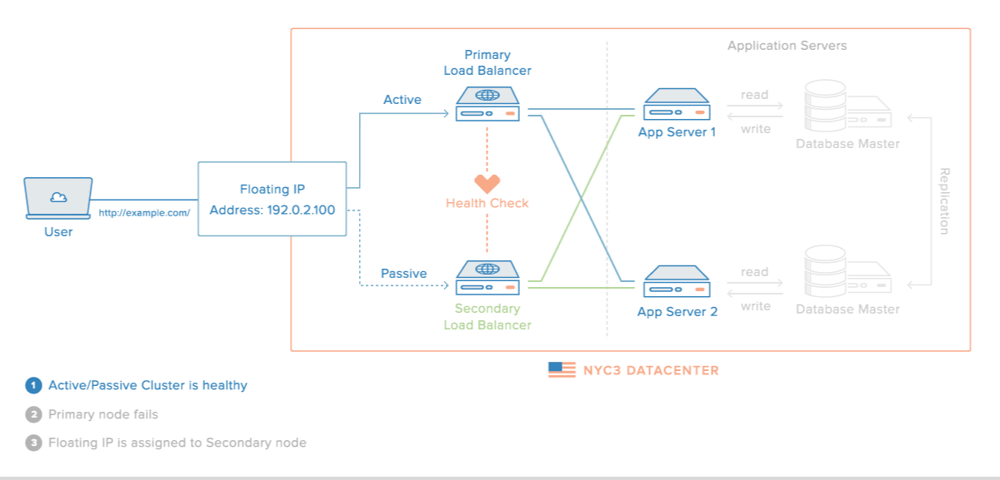
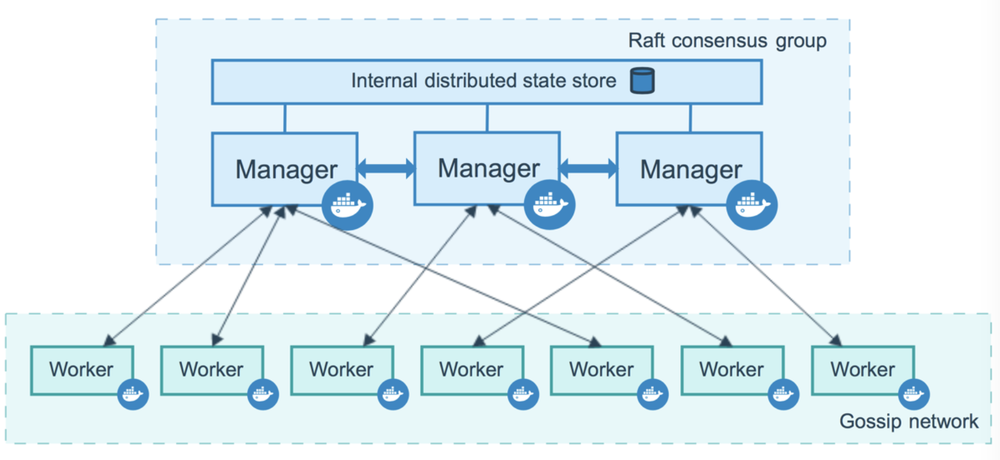
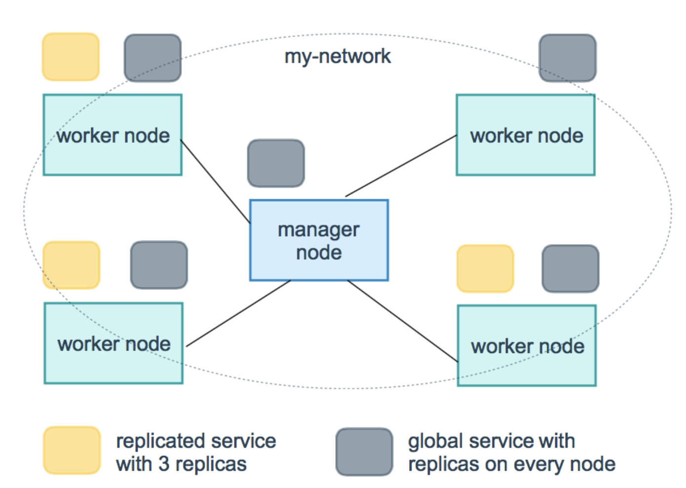
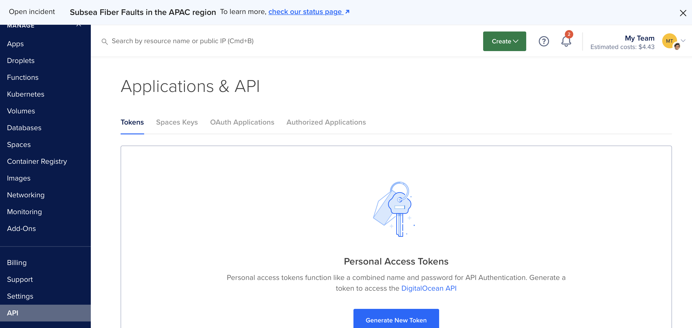

# Availability

Mircea Lungu, Associate Professor,<br>
[IT University of Copenhagen, Denmark](https://www.itu.dk)<br>
`mlun@itu.dk`


# Introduction

## The story of healthcare.gov

Highly anticipated launch (e.g. the [healthcare.gov](https://www.cbsnews.com/news/healthcaregov-plagued-by-crashes-on-1st-day/) story) that resulted in the system experiencing a performance degradation 


> Instead of new choices, the website told him to wait. Attempts to log on with a CBS News producer's iPad failed too. 
> After more than an hour, he gave up.
> "I was excited to get on, and I can't, so yeah I'm disappointed," Matt Warren said.
> Matt Warren said he will try again Wednesday. There are about six million uninsured residents in Texas. It's estimated half of them could be covered by the Affordable Care Act.
https://www.cbsnews.com/news/healthcaregov-plagued-by-crashes-on-1st-day/


## Availability 

Availability refers to the **proportion of time that a system or service is operational** and accessible for use. 

Relevant especially in the context of 
- online services and apps
- banks
- healthcare
- cloud-based applications
- mission-critical systems

High availability means that users can access the system without significant interruptions or downtime.

## How do we achieve high availability? 

Two of the most essential strategies are

- **Redundancy** 
- **Scalability**


# Redundancy

## Thought Experiment: What the problem with the following architecture?

This is probably the architecture that many of your systems have at the moment. 


We say that such an architecture has a **single point of failure** because *a part of the system failing will stop the entire system from working*. 

---

## Did we remove the single point of failure in this new architecture? 

This scenario has different containers run on different machines (V or not V ;). 



--

No. The scenario is not better from an availability POV. Here we just have more **single points of failure** because each hardware node is one such possible point of failure. 

---

## What can we learn from nature with regard to availability?

We can learn from one of the most marvelous systems that we are aware of: the human body. It is resilient at multiple levels of abstraction. We have two lungs, two kidneys, two eyes, etc. But much more than that: every cell has the whole DNA of the whole thing inside it! 


The solution nature found with respect to availability and removing single points of failure is: **redundancy.**

## Redundancy 

In system design **redundancy** means *adding extra (hardware and/or software) components to the system and designing such that **in case one fails another can take over** 

Solution to the single-point of failure problem. 

It introduces other problems:
- cost: it is more expensive 
- synchronization: keeping redundant components in sync can be challenging

[More](https://csis.pace.edu/~marchese/CS865/Lectures/Chap8/New8/Chapter8.html) on redundancy.


# Scalability

Designing the system to scale easily by being able to add more resources when needed to accommodate increased demand.


## Motivational example

> > Your user authentication system is slow, and your application becomes really popular with many users trying to create accounts at the same time. The server’s CPU becomes a bottleneck hashing algorithms used by the application is computationally intensive, causing login delays, and users going away from the system. 


What's the problem in this situation? 


## Congestion

= **reduced quality of service that occurs when a network node or link is attempting to handle more data than it can**

Possible Reasons for congestion, 
- Seasonal spikes in demand
- Highly anticipated launches (healthcare.gov)
- Traffic surges (e.g. [The Slashdot effect](https://en.wikipedia.org/wiki/Slashdot_effect), etc.)


## Solution to congestion?

The first and most important solution is 

- **Performance optimization:*** Ensuring that the system is designed and tuned to handle the expected load efficiently, reducing the risk of bottlenecks and failures.

The second solution to congestion is **Scaling**. 

Of which there are two kinds: 
1. **Vertical**
2. **Horizontal**

# Vertical Scaling

**Replacing resources with larger or more powerful ones**

* In a **physical server**: open the hood, and add: more memory, disk, etc.
* In a **VM**: reconfigure the machine programmatically

*Story*: When the internet became slow during my Zeeguu demo.


## Example 1. Vertical Scaling with the VirtualBox  GUI

1. Power Off VM 
2. Modify RAM and storage (either via GUI or CLI)
3. Power On VM
4. From within the VM update the OS wrt your new disk size (takes a while!)



Repartitioning 
  - e.g. with `gparted` or similar tools

---

## Example 2: VirtuaBox and CLI

```bash
$ VBoxManage list vms
"coursevm" {e072b310-1922-4113-93f5-2ca865e01722}
"lsd2018vm" {67fda2ea-7c3e-42f6-9a13-d0908020322d}
```

```bash
$ VBoxManage modifyvm "coursevm" --cpus 8
$ VBoxManage modifyvm "coursevm" --memory 8192
```


```bash
$ VBoxManage list hdds

UUID:           9953ea1b-7295-4547-94fa-209f49c258f5
Parent UUID:    base
State:          created
Type:           normal (base)
Location:       /path/to/node1ubuntu-16.04-amd64-disk001.vmdk
Storage format: VMDK
Capacity:       40960 MBytes
Encryption:     disabled
    ```
    
```sh
$ VBoxManage clonehd "9953ea1b-7295-4547-94fa-..." "cloned.vdi" --format vdi
$ VBoxManage modifymedium disk "cloned.vdi" --resize 65536
```

Notes:

Optionally, you may want to convert the disk back to `vmdk` with `VBoxManage clonehd "cloned.vdi" "resized.vmdk" --format vmdk`


See More:
      * Modfication of RAM https://www.virtualbox.org/manual/ch08.html#vboxmanage-modifyvm 
      * Modification of storage https://www.virtualbox.org/manual/ch08.html#vboxmanage-modifyvd

---

## Example 3: Vertical Scaling with DigitalOcean

Similar to VirtualBox, only that on the Web

**You can only resize VMs that are not running**.


    


See https://www.digitalocean.com/docs/droplets/how-to/resize/#resizing-via-the-control-panel

---

## Example 4: Vertical Scaling With the REST API  of DigitalOcean

```bash
$ curl -X POST -H 'Content-Type: application/json' \
	   -H "Authorization: Bearer $DIGITAL_OCEAN_TOKEN" \
	   -d '{"type":"resize","size":"s-2vcpu-4gb"}' \
	   "https://api.digitalocean.com/v2/droplets/$DROPLET_ID/actions" | jq
```

*Notes:* 
- $DIGITAL_OCEAN_TOKEN environment variable is defined
- $DROPLET_ID is defined
- Image types and sizes at: https://slugs.do-api.dev/
--

- Resize CPU and RAM **automatically shuts down the droplet** 

```bash
$ curl -X POST -H 'Content-Type: application/json' \
-H "Authorization: Bearer $DIGITAL_OCEAN_TOKEN" \
-d '{"type":"power_on"}' \
"https://api.digitalocean.com/v2/droplets/$DROPLET_ID/actions"
```

Discussion: why REST is particularly nice for IaC

---

## When is vertical scaling appropriate?

- Legacy systems (e.g. bank mainframes)

- Some types of software that does not scale well horizontally. e.g. databases that don't cluster well

- Predictable growth -- when you can anticipate the growth of demand on your system, and that growth can be serviced by the vertically scaled infra


---
## When is vertical scaling not appropriate? 

- You have to adapt fast to varying workload (e.g. Amazon's Black Friday)

- Complicated to scale down (often)
	- Slow: it implies switching machines off and on (both VM and physical)

- Some workloads are simply too big for vertical scaling
	- Facebook, Google, etc. 
	- [Brief History of Scaling at LinkedIn](https://engineering.linkedin.com/architecture/brief-history-scaling-linkedin): *"An easy fix we did was classic vertical scaling ... While that bought some time, we needed to scale further"*
	- Scientific computing
		- seismic analysis 
		- biotechnology
		- SETI@Home


# Horizontal Scaling

= **Increasing the computing power by**
- **adding more machines to a setup** and
- **making all the machines share the responsibilities**


*We take it for granted, but it was a very revolutionary idea two decades ago*

- [As of **2000** Google can not host all their DB on a single machine](https://www.linkedin.com/pulse/how-did-google-scale-untold-story-shrey-batra/?trk=articles_directory). 
- The only way that Google could keep up was by buying normal computers and wiring them together into a fleet
- Because half the cost of these computers was considered junk—floppy drives, metal chassis—the company would order raw motherboards and hard drives and sandwich them together.
- To survive, Google would have to unite its computers into a seamless, resilient whole
- In **2004** they introduce the [MapReduce paper](papers/mapreduce-osdi04.pdf) to propose an architecture for distributing the DB and subsequent queries over an array of machines 


# Horizontal Scaling 101: Automated Load-Balancing

= **Distributing traffic to - and computation across multiple servers**

- Ensures no single server bears too much demand
- Improves responsiveness


Solves **scaling** and SPF at the application server level but... 

... load balancer is still SPF

Image from: [Horizontally Scaling PHP Applications](https://blog.digitalocean.com/horizontally-scaling-php-applications/)


---
## Redundant Load Balancer Setup

How to make the balancer not anymore a single point of failure: [Heartbeat and Floating IP](https://www.digitalocean.com/community/tutorials/how-to-create-a-high-availability-setup-with-heartbeat-and-floating-ips-on-ubuntu-16-04))

[](https://assets.digitalocean.com/articles/high_availability/ha-diagram-animated.gif)

- [Floating IP](https://blog.digitalocean.com/floating-ips-start-architecting-your-applications-for-high-availability/)  (Reserved IP since 2022)
	 - DigialOcean name for static IPs
	 - Equivalents on other platforms, e.g. Elastic IPs @ Amazon
- Keepalived - daemon used for health check


Where to read more about this setup
- [Load Balancing as a Service on DO](https://blog.digitalocean.com/load-balancers-simplifying-high-availability/)
- [HAProxy with Keepalived on Ubuntu](https://kifarunix.com/configure-highly-available-haproxy-with-keepalived-on-ubuntu-20-04)

---

# Advanced Scaling: Container Orchestration Platforms 


Container Orchestration Tools
- **Manage computing nodes** and services
- **Schedule tasks** in a resource aware manner


## Many Container Orchestration Alternatives


**Docker Swarm Mode**
- Comes with Docker by default
- The easiest to use from all the alternatives


 **Kubernetes** 
  * Originally developed at Google
  * We don't ask you to use it because we're nice :) ([see hacker news discussion](https://news.ycombinator.com/item?id=26271470))
  
 ... and [many more](https://devopscube.com/docker-container-clustering-tools/)

  

## Docker Swarm Mode Concepts

The following [concepts are essential for understanding Docker Swarm mode](https://docs.docker.com/engine/swarm/key-concepts/#what-is-a-swarm)

0. Cluster = swarm = a group of hosts (nodes) that work together to create a distributed system
1. Node = A machine (physical or virtual) participating in a Swarm cluster
	  - Managers
	  - Workers
2. Service 
3. Task
4. Routing Mesh

They have equivalents in other orchestration environments.


### 1. Manager Node

  * Maintain swarm (cluster) state
  * Schedule services on the nodes
  * Designed for redundancy: *n manager swarm* tolerates loss of *(n-1)/2* managers




Notes: 
- Docker recommends a *maximum of seven manager nodes for a swarm* (!?!)
- More managers does NOT mean increased scalability or higher performance. In general, the opposite is true


### 2. Worker Node

A machine which from the POV of the swarm
  * runs an instance of Docker Engine 
  * executes Docker containers
  * has at least one manager node

Notes: 
  * By default, all managers are also workers


See more [https://docs.docker.com/engine/swarm/how-swarm-mode-works/nodes/](https://docs.docker.com/engine/swarm/how-swarm-mode-works/nodes/)

### 3. Service

- The primary abstraction of user interaction with the swarm 
- Defined by: 
	- docker image
	- the port where the service is available outside of the swarm
	- number of replicas to run in the swarm


 More on [services](https://docs.docker.com/engine/swarm/how-swarm-mode-works/services/)

#### Types of Services

Can be 
- **replicated** - allows you to select the level of replication 
- **global** - exactly one replica running on each node

To think about:
- *What service does it make sense to have "global" replication for?*
- *What services should not be replicated (i.e., replication level = 1)?*

  



Good examples of global service? A **log shipper** or a **monitoring container**. It is important to ensure that the service is running on every node. By deploying the service as a global service, you can ensure that every node in the cluster has a copy of the service running, which can collect data from that node and forward it to a centralized location.


### 4. Task

*"A service is a description of a desired state, and a task does the work"*

- The atomic scheduling unit of swarm
- Carries **a container and the commands to run inside it**
- Manager nodes assign tasks to worker nodes according to the number of replicas set in the service scale
 


### 5. The Routing Mesh

- Routes all incoming requests to published ports on available nodes to an active container

- Enables each node in the swarm to accept connections 
  - on published ports 
  - for any service running in the swarm
  - even if there’s no task (container) running on the node

- Can support load balancing in Docker Swarm


Read more:  https://docs.docker.com/engine/swarm/ingress


# Interactive 

### CLI Deployment of A Docker Swarm cluster on DigitalOcean


- create a new token 


- Define the envvar: 
```
DIGITAL_OCEAN_TOKEN=blablabla
```
- Install the `jq`  command line tool if you don't already have it (e.g., `brew install jq` on a mac)
- [Upload](https://docs.digitalocean.com/products/droplets/how-to/add-ssh-keys/to-team/#upload-an-ssh-key-to-a-digitalocean-team-with-the-control-panel)  your SSH public key in DigitalOcean>Settings>Security


### New Docker Commands

  * `docker swarm` ... to manage a cluster (swarm)
  
  * `docker service` ... to manage replicated containers (services) in the swarm


### Creating a Docker Swarm Cluster Node


```sh
export DIGITALOCEAN_PRIVATE_NETWORKING=true
export DROPLETS_API="https://api.digitalocean.com/v2/droplets"
export BEARER_AUTH_TOKEN="Authorization: Bearer $DIGITAL_OCEAN_TOKEN"
export JSON_CONTENT="Content-Type: application/json"

```

- replace the fingerprint with your own 
```bash 

CONFIG='{"name":"swarm-manager","tags":["demo"],
	"size":"s-1vcpu-1gb", "image":"docker-20-04",
	"ssh_keys":["01:97:fe:0a:01:e3:a9:68:99:60:b5:e9:74:30:8f:71"]}'

SWARM_MANAGER_ID=$(curl -X POST "$DROPLETS_API" -d "$CONFIG"\
	-H "$BEARER_AUTH_TOKEN" -H "$JSON_CONTENT"\
	| jq -r .droplet.id ) && sleep 5 && echo $SWARM_MANAGER_ID
```


```bash

export JQFILTER='.droplets | .[] | select (.name == "swarm-manager") 
	| .networks.v4 | .[]| select (.type == "public") | .ip_address'


SWARM_MANAGER_IP=$(curl -s GET "$DROPLETS_API"\
    -H "$BEARER_AUTH_TOKEN" -H "$JSON_CONTENT"\
    | jq -r "$JQFILTER") && echo "SWARM_MANAGER_IP=$SWARM_MANAGER_IP"

```

See: [Generating ssh key fingerprint](https://superuser.com/a/453022), [API doc for creating a droplet](https://docs.digitalocean.com/reference/api/api-reference/#operation/droplets_create) 


---

### Creating Worker Nodes


#### Worker1
```bash
WORKER1_ID=$(curl -X POST "$DROPLETS_API"\
       -d'{"name":"worker1","tags":["demo"],"region":"fra1",
       "size":"s-1vcpu-1gb","image":"docker-20-04",
       "ssh_keys":["a7:39:2c:a6:21:f8:a2:6d:33:a7:d9:87:1f:c9:d4:57"]}'\
       -H "$BEARER_AUTH_TOKEN" -H "$JSON_CONTENT"\
       | jq -r .droplet.id )\
       && sleep 3 && echo $WORKER1_ID
```

```bash

export JQFILTER='.droplets | .[] | select (.name == "worker1") | .networks.v4 | .[]| select (.type == "public") | .ip_address'


WORKER1_IP=$(curl -s GET "$DROPLETS_API"\
    -H "$BEARER_AUTH_TOKEN" -H "$JSON_CONTENT"\
    | jq -r "$JQFILTER")\
    && echo "WORKER1_IP=$WORKER1_IP"

```


#### Worker2
```bash
WORKER2_ID=$(curl -X POST "$DROPLETS_API"\
       -d'{"name":"worker2","tags":["demo"],"region":"fra1",
       "size":"s-1vcpu-1gb","image":"docker-20-04",
       "ssh_keys":["a7:39:2c:a6:21:f8:a2:6d:33:a7:d9:87:1f:c9:d4:57"]}'\
       -H "$BEARER_AUTH_TOKEN" -H "$JSON_CONTENT"\
       | jq -r .droplet.id )\
       && sleep 3 && echo $WORKER2_ID
```

```bash

export JQFILTER='.droplets | .[] | select (.name == "worker2") | .networks.v4 | .[]| select (.type == "public") | .ip_address'


WORKER2_IP=$(curl -s GET "$DROPLETS_API"\
    -H "$BEARER_AUTH_TOKEN" -H "$JSON_CONTENT"\
    | jq -r "$JQFILTER")\
    && echo "WORKER2_IP=$WORKER2_IP"

```


### Making `swarm-manager` a Cluster Manager


##### Open the ports that Docker needs
```sh
ssh root@$SWARM_MANAGER_IP "ufw allow 22/tcp && ufw allow 2376/tcp &&\
ufw allow 2377/tcp && ufw allow 7946/tcp && ufw allow 7946/udp &&\
ufw allow 4789/udp && ufw reload && ufw --force  enable &&\
systemctl restart docker"
```
Read about the [roles of the ports](https://docs.docker.com/engine/swarm/swarm-tutorial/#the-ip-address-of-the-manager-machine)


##### Initialize the swarm
```sh
ssh root@$SWARM_MANAGER_IP "docker swarm init --advertise-addr $SWARM_MANAGER_IP"

```


```bash
Swarm initialized: current node (sozjy3nmfrieacm2pbgj41ek3) is now a manager.

To add a worker to this swarm, run the following command:

    docker swarm join --token SWMTKN-1-4rndqz4hwe38wtbl9fwgj33rk48ok3hri7a0xy42o7sf5ll38z-afkri2vu57m5z31v34bny16aj 142.93.109.102:2377

To add a manager to this swarm, run 'docker swarm join-token manager' and follow the instructions.```


### Converting node-1 and node-2 to Workers

##### Let's get that token from the swarm-manager

```sh
$ ssh root@$SWARM_MANAGER_IP "docker swarm join-token worker -q"
SWMTKN-1-4rndqz4hwe38wtbl9fwgj33rk48ok3hri7a0xy42o7sf5ll38z-afkri2vu57m5z31v34bny16aj

$ WORKER_TOKEN=`ssh root@$SWARM_MANAGER_IP "docker swarm join-token worker -q"`
```

##### and build a command that we can run on node-1 and node-2 to join the swarm.
```sh
REMOTE_JOIN_CMD="docker swarm join --token $WORKER_TOKEN $SWARM_MANAGER_IP:2377"

ssh root@$WORKER1_IP "$REMOTE_JOIN_CMD"
```

```
  This node joined a swarm as a worker.
```

```sh
ssh root@$WORKER2_IP "$REMOTE_JOIN_CMD"
```

```
  This node joined a swarm as a worker.
```


### Seeing the state of the cluster on the manager

```sh

$ ssh root@$SWARM_MANAGER_IP "docker node ls"

ID                            HOSTNAME            STATUS              AVAILABILITY        MANAGER STATUS      ENGINE VERSION
sozjy3nmfrieacm2pbgj41ek3 *   node-0              Ready               Active              Leader              18.09.0
hy6ie5xq561f9w1zpiyaqkrk5     node-1              Ready               Active                                  18.09.0
```


### Starting a Service

Now that everything is setup, let's run a service on our cluster:

```sh
$ ssh root@$SWARM_MANAGER_IP "docker service create -p 8080:8080 --name appserver stifstof/crashserver"
overall progress: 0 out of 1 tasks
...
overall progress: 1 out of 1 tasks
verify: Waiting 5 seconds to verify that tasks are stable...
...
verify: Waiting 1 seconds to verify that tasks are stable...
verify: Service converged
```

... about 1-2 min ..


### Checking the state of the service


```bash
$ ssh root@$SWARM_MANAGER_IP "docker service ls"
ID                  NAME                MODE                REPLICAS            IMAGE                        PORTS
ttkqm9wzthgu        appserver           replicated          1/1                 stifstof/crashserver:latest   *:8080->8080/tcp
```

You may directly ask for the state of a service with

```bash
$ ssh root@$SWARM_MANAGER_IP "docker service ps appserver"
```


Now, on a Mac you can: 

```sh
$ open http://$SWARM_MANAGER_IP:8080
```

Alternatively, navigate manually to the swarm manager's IP port 8080 and see the webpage served. 


### Checking that the Swarm also restarts services


To demonstrate this we used the ***crashserver service***: a webserver which kills itself three seconds after serving an http request

Take some time and observe the behavior of the container before continuing with the guide. 
- note how the infrastructure is self-healing, by checking the state of the service multiple times after an invocation as shown above.
- the service becomes unavailable while Swarm is recreating the container after it has been killed


### Scaling the service to increase availability?

```bash
$ ssh root@$SWARM_MANAGER_IP "docker service scale appserver=5"
$ ssh root@$SWARM_MANAGER_IP "docker service ls"

ID                  NAME                MODE                REPLICAS            IMAGE                        PORTS
ttkqm9wzthgu        appserver           replicated          5/5                 stifstof/crashserver:latest   *:8080->8080/tcp


$ ssh root@$SWARM_MANAGER_IP "docker service ps appserver"


ID                  NAME                IMAGE                        NODE                DESIRED STATE       CURRENT STATE            ERROR               PORTS
vbg02o9bsaog        appserver.1         stifstof/crashserver:latest   node-1              Running             Running 7 minutes ago
mudpe1lokpj7        appserver.2         stifstof/crashserver:latest   node-0              Running             Running 13 seconds ago
t7enei6pz4jw        appserver.3         stifstof/crashserver:latest   node-0              Running             Running 12 seconds ago
sfpn4f2kg5nq        appserver.4         stifstof/crashserver:latest   node-1              Running             Running 39 seconds ago
wa8f99b6t199        appserver.5         stifstof/crashserver:latest   node-0              Running             Running 12 seconds ago
```


### Does the replication work?

You should now be able to invoke the webpage without seeing the error-page each time the container is killed, but instead see the request being served by another container. Nice!

Although it is possible to kill all container by manically invoking the /status endpoint, if you want to test the self-healing feature of swarm, you can invoke the /kill endpoint, which will kill the container immediately, so you don't have to wait.  


### Checking that the routing mesh works as advertised


```sh
open http://$WORKER1_IP:8080
```

```sh
open http://$WORKER2_IP:8080
```

Note: Make sure to open port 8080 from the firewall.


### Cleaning up to not pay anymore...


```bash
curl -X DELETE\
  -H "$BEARER_AUTH_TOKEN" -H "$JSON_CONTENT"\
  "https://api.digitalocean.com/v2/droplets?tag_name=demo"
  
```
See: [documentation](https://docs.digitalocean.com/reference/api/api-reference/#operation/droplets_destroy_byTag)  for the delete API endpoint


Note: 
- The interactive guide is based on the [tutorial at DigitalOcean](https://www.digitalocean.com/community/tutorials/how-to-create-a-cluster-of-docker-containers-with-docker-swarm-and-digitalocean-on-ubuntu-16) 


# Stateless vs. Stateful Services 

There are two types of services: 

- **Stateless**
	- Does not maintain any internal state or data between requests. 
	- Each request is handled independently
	- Ideal for horizontal scaling and load balancing.

- **Stateful** 
	- Maintains internal state or data that persists across requests or instances
	- Examples include databases and file storage services 
	- Replicating stateful services introduces challenges related to data consistency, synchronization, and failover


# How do you upgrade a service when it's replicated? 

Two possible upgrade strategies: 

1. Blue-Green
2. Rolling Updates


## Blue-green

Conceptually: 
- **Two identical environments, where only one (green) is hot at any time**
- Use the blue environment as your staging environment for the final testing step for your next deployment


Step by step: 
  1. Currently deployed application (Green) is serving incoming traffic
  2. New version (Blue) is deployed and tested, but not yet receiving traffic
  3. When Blue is ready, LB starts sending incoming traffic to it too
  4. For a while: two versions of the application run in parallel
  5. LB stops sending incoming traffic to the "Green"; "Blue" is handling all the incoming traffic
  6. Green can now be safely removed
  7. Blue is marked as Green...

More about [colorful deployments](https://opensource.com/article/17/5/colorful-deployments) 


## Rolling Updates

**Deploy the upgrade in rolling iterations**

Rolling Updates in Docker Swarm:
1. Stop the first *task*
2. Schedule update for the stopped task
3. Start the container for the updated task
4. If the update to a task returns RUNNING, wait for the specified delay period (`--update-delay` flag) then start the next task
5. If, at any  me during the update, a task returns FAILED, pause the update
  
Note: 
- **You need at least two replicas otherwise there will be downtime**
- [Rolling Updates Swarm Tutorial](https://docs.docker.com/engine/swarm/swarm-tutorial/rolling-update/ ) 


## Upgrade Strategies in Docker Swarm 

Two `update-order` options: (stop-first|start-first) 
- `stop-first` (default) -- corresponds to rolling updates
- `start-first` -- corresponds to blue-green service deployment


# How to migrate from docker-compose to docker swarm?

Simplest way is to add the extra information needed in the docker-compose.yml unde the **deploy** key:
- replicas
- [placement constriants](https://docs.docker.com/engine/swarm/services/): labels, roles, other props of nodes
- update strategies, restart strategies
- [etc](https://docs.docker.com/compose/compose-file/deploy/).

Example: 
```
  api:
    image: itudevops/go-minitwit-api:TAG
    deploy:
      replicas: 2
      update_config:
        delay: 10s
        order: start-first
      placement:
        constraints:
          - "node.role==manager"
          - "node.hostname!=dbvm"
          - "node.label==frankfurt"
```

# Why *not* horizontal scaling?

**It can be more complicated that vertical** (see [hacker news thread on k8s](https://news.ycombinator.com/item?id=26271470))

**Because Google and Facebook need it**

- There are many large scale infras that use veritcal scaling
	- Thibault Duplessis on the architecture of Lichess
	- StackOverflow does not use horizontal scaling ([podcast](https://hanselminutes.com/847/engineering-stack-overflow-with-roberta-arcoverde), [tweet](images/StackOverflowInfraTweet.png))
- If Google needs it, than probably you don't 

**To make up for bad architecture**: algo, comm patterns, language, etc.


# What Next?

Exercise: *Try out the swarm creation example from this lecture*
Practical: [Scale your API](README_TASKS.md) in preparation for the future increase in user requests.

